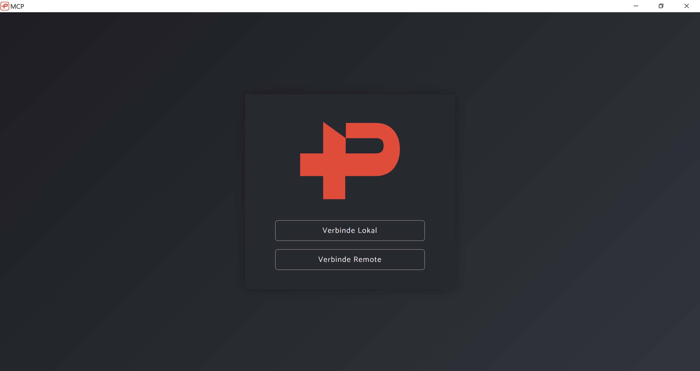
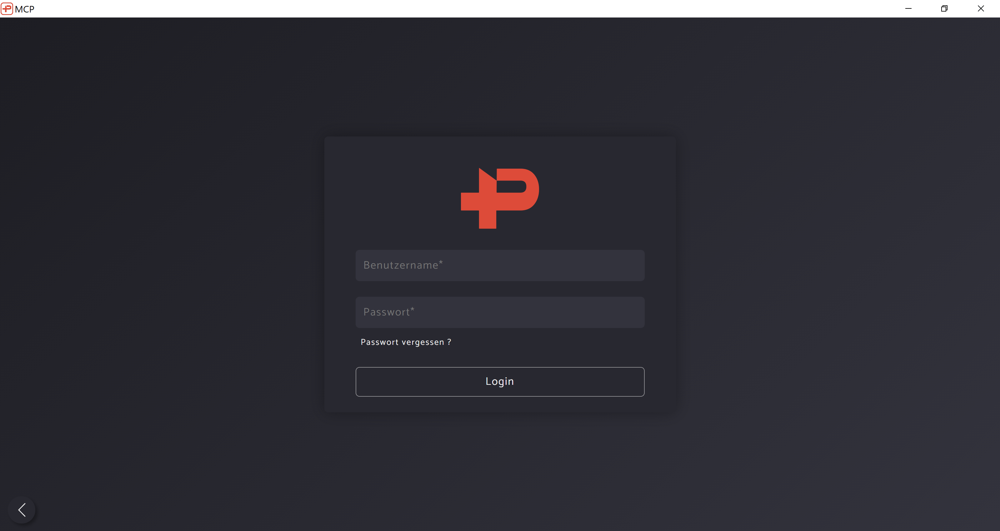
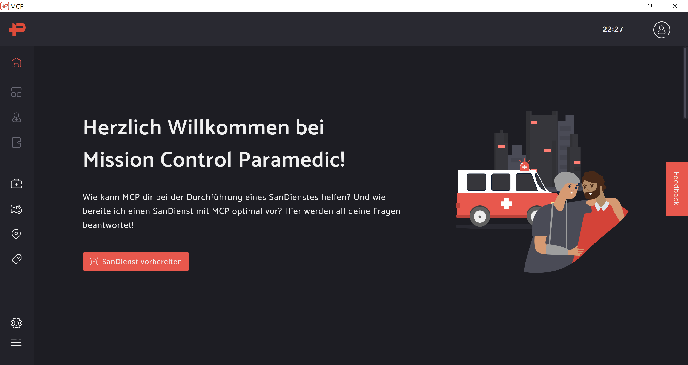
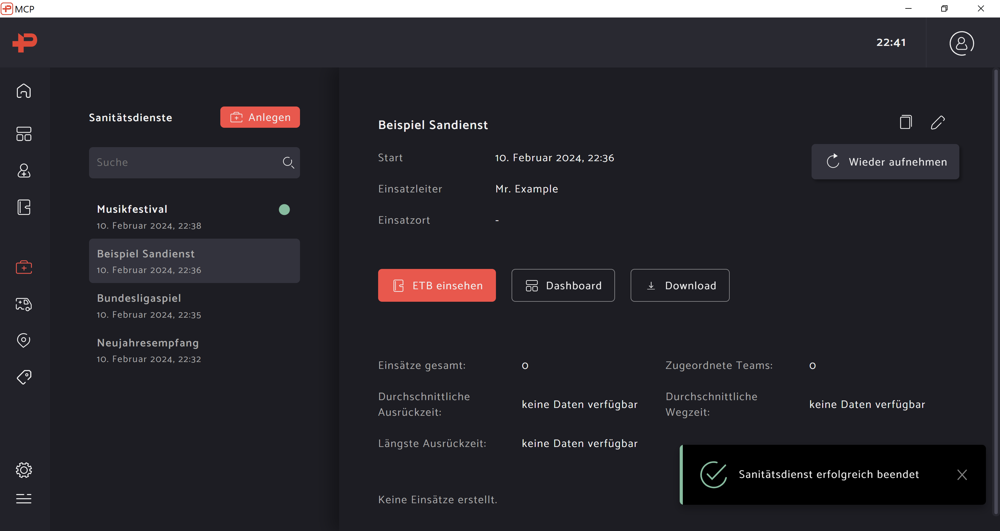
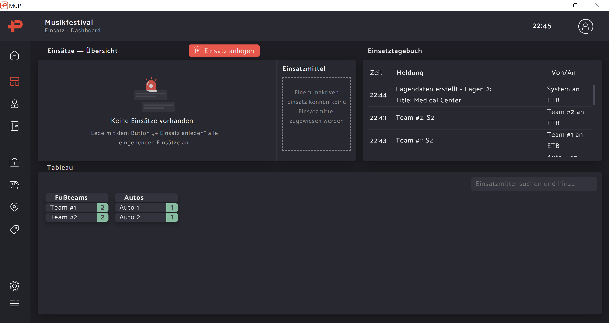
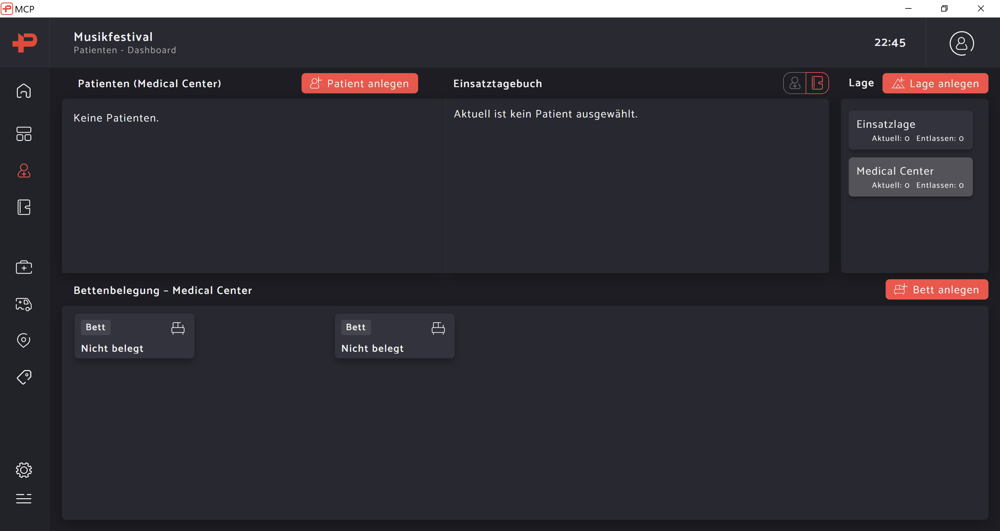

# Einführung

## Was ist MCP?

Mission Control Paramedic, kurz MCP, ist eine Einsatzleitsoftware für die Führung und Organisation von Sanitätsdiensten.
Fokus der Software ist es, intuitiv und übersichtlich zu sein, sodass in jeder Situation der Überblick behalten werden 
kann.

Die Software ist im Rahmen der Initiative "Coding for Charity" von [inovex](https://www.inovex.de/) in Kooperation mit 
dem Deutschen Roten Kreuz entstanden.

Zu den weiteren Vorteilen der Software gehört, dass diese kostenfrei ist und nicht nur unter Windows läuft, sondern auch
anderen Plattformen wie z.B. macOS unterstützt.

## Wann verwende ich MCP?

MCP wird dir auf einem kleinen Sanitätsdienst mit zwei Personen auf einer Sportveranstaltung recht wahrscheinlich nicht 
begegnen, denn recht wahrscheinlich habt ihr keinen Computer dabei und euch wird euch keinen wirklichen Mehrwert 
bringen.

Eine Einsatzleitsoftware ist erst hilfreich, sobald ihr einen Einsatz oder Sanitätsdienst mit Führungskräften habt. 
Dabei ist es egal, ob dies ein kleiner Dienst mit einfach nur drei Fußteams ist oder doch so große Veranstaltung, wie 
z.B. Fußballspiele der ersten und zweiten Fußballliga oder Festivals. Erst in dieser Situation haben eure Führungskräfte
die Möglichkeit, die gesamte Situation mit einer Einsatzleitsoftware im Überblick zu behalten und zu koordinieren, 
während die Teams an Hilfskräften einfach ihren Aufgaben nachgehen können.

## MCP starten

Als Helferin oder Helfer kommt man schnell in die Situation auf einem Dienst, Mission Control Paramedic zu verwenden. In
diesen Fällen ist häufig die entsprechende Infrastruktur und Geräte, wie z.B. Internet und ein Computer, bereits 
vorhanden, aufgebaut und eingerichtet ist.

!!! note "Notiz"

    In diesem Abschnitt wird sich auf die Benutzung von MCP für eine Helferin oder einen Helfer konzentriert. 
    Anleitungen für die Installation und Einrichtung von Mission Control Paramedic (MCP) als die Anleitung für das
    Führungspersonal kann in den entsprechenden Abschnitten gefunden werden.

Zuallererst müsst ihr euren Computer bereit machen, also ihn einschalten und euch anmelden. Für die weitere Anleitung 
wird angenommen, dass ihr erfolgreich euren Computer gestartet und angemeldet habt.

Um Mission Control Paramedic (MCP) verwenden zu können, müsst ihr die gleichnamige Anwendung auf dem entsprechenden 
Computer starten. Dies könnt ihr z.B. mit einem Doppelklick auf die auf dem Desktop hinterlegte Verknüpfung zu MCP 
machen oder einen passenden Eintrag im Startmenü nutzen.

## Verbindungsaufbau

Nach dem Start der Anwendung werdet ihr mit folgendem Fenster begrüßt.

Nun hat man zwei Optionen zur Auswahl, wie man MCP verwenden kann. Mit der ersten Option kann man die lokale MCP-Instanz
verwenden, wo dann die Daten auch auf dem Computer gespeichert werden. Gleichzeitig stellt man die eigene MCP-Instanz 
auch im lokalen Netzwerk bereit, sodass sich andere MCP-Instanzen damit verbinden können, wenn das Netzwerk entsprechend
freigeschaltet ist.

Alternativ kann man sich mit einer anderen MCP-Instanz verbinden, wo dann die Daten für MCP nutzt, die auf einem anderen
Computer gespeichert werden. Damit ihr euch mit einer anderen MCP-Instanz verbinden könnt, benötigt ihr die IP-Adresse
des anderen Computers, um die Verbindung aufzubauen. MCP speichert außerdem immer die letzte Adresse, mit der man sich
verbunden hat.

Im Regelfall wird die MCP-Instanz von der Einsatzleitung bzw. den Führungskräften bereitgestellt, sodass du dich als 
Helfer mit dieser Remote-Instanz nur verbinden musst. Da dies meist schon vorbereitet ist und auch getestet wurde, ist
es recht wahrscheinlich, dass dort schon die richtige Adresse steht. Sollte dort nichts stehen, du dir unsicher sein 
oder keine Verbindung mit der dort stehenden Instanz möglich sein, dann wende dich bitte an deine zuständige 
Führungskraft.

!!! bug "Bug"

    Achte beim Verbinden mit Remote-Rechnern auf die Adresse bzw. Url, welche im Feld steht. Sollte dort 
    `https://127.0.0.1:443` stehen, dann wurde sich beim letzten Mal mit der lokalen Instanz verbunden und nicht mit 
    einer Remote-Instanz.

## Anmeldung

Sobald du dich erfolgreich mit einer MCP-Instanz verbunden hast, wirst du nach gültigen Zugangsdaten für die jeweilige
MCP-Instanz gefragt. Diese Authentifizierung ist notwendig, da mit besonders schützenwerten persönlichen Daten 
gearbeitet wird und diese vor unberechtigtem Zugriff geschützt werden müssen. Die Anmeldemaske sieht wie folgt aus.

Ihr solltet die Anmeldedaten von eurer Führungskraft erhalten, solltet ihr sie sonst nicht schon kennen. Falls dies 
nicht der Fall ist, fragt bei deiner Führungskraft einfach nach.

Nach einer erfolgreichen Anmeldung landet ihr dann auf der Startseite.

!!! note "Anmerkung"

    Die Wiederherstellung des Zugangs eines Kontos mit verlorenen Zugangsdaten ist möglich. Details zur Einrichtung 
    davon werden im Abschnitt zur Installation behandelt. Die Wiederherstellung selbst wird im Fortgeschrittenen Bereich
    erklärt.

## Startseite

Auf der Startseite von Mission Control Paramedic sieht ihr nicht viel, ihr bekommt aber einen guten Überblick über das
Interface. Dieses ist wie folgt aufgebaut:

An der linken Seite findet ihr die Navigationsleiste. Diese besteht aus verschiedene Icons bzw. Piktogrammen, die euch 
zu den unterschiedlichen Funktionen führen. Über das unterste Piktogramm in Form einer Liste lässt sich die 
Navigationsleiste ausklappen, sodass ihr auch die Namen der folgenden Einträge lesen könnt:

- Home
- Einsatz-Dashboard
- Patienten-Dashboard
- Einsatztagebuch
- Sanitätsdienste
- Einsatzmittel
- Orte
- Einsatzschlagworte
- Einstellungen
- Schalter ein- und ausklappen der Navigationsleiste, wo im ausgeklappten Zustand auch noch Verbindungsinformationen 
  angezeigt werden.

In den folgenden Abschnitten wird euch das Einsatz-Dashboard, das Patienten-Dashboard und der Eintrag zu den 
Sanitätsdiensten erklärt, die ihr auch am meisten verwenden werdet. Im Einsatztagebuch dokumentieren die Führungskräfte
den Einsatz, weshalb man diese Funktion als Helfer normalerweise nicht benötigt. Die anderen Funktionen sind für die 
Verwaltung der Daten in Mission Control Paramedic da. Da ihr im Regelfall eine MCP-Instanz mit einem Sanitätsdienst von
euren Führungskräften bereitgestellt bekommt, sollten die Daten auch schon passend eingepflegt sein und ihr nichts mehr
daran ändern müssen.

!!! warning "Achtung"

    Sei nicht verwundert, wenn die drei Einträge zum Einsatz-Dashboard, Patienten-Dashboard und Einsatztagebuch 
    ausgegraut bzw. deaktiviert sind, wie es im Bild oben auch dargestellt ist. Dies ist kein Fehler, sondern liegt nur
    daran, dass es aktuell noch keinen Sanitätsdienst gibt, der aktiv läuft. Sollte dies nicht der Fall sein, dann wende
    dich an deine Führungskraft, um dies zu klären.

!!! note "Anmerkung"
    
    Die Einträge zu den Einsatzmitteln, den Orten, den Einsatzschlagwörtern und dem Einsatztagebuch werden im 
    fortgeschrittenem Bereich erklärt.

Zusätzlich zur Navigationsleiste gibt es oben noch eine Statusleiste. Rechts in der Ecke wird euch die aktuelle Uhrzeit
angezeigt und daneben findet ihr ein Profil-Icon. Wenn ihr darauf klickt, öffnet sich ein kleines Menü dazu. Dort 
findet ihr einen Eintrag mit eurem Nutzernamen, womit ihr auf eurer Nutzerprofil kommen könnt, und einem Eintrag, womit
ihr euch abmelden könnt. Sollte euer Benutzer Administrator-Rechte in Mission Control Paramedic haben, so wird es noch
einen weiteren Eintrag "Team" zur Verwaltung des Teams bzw. aller Benutzer geben.

!!! tip "Tipp"

    Mit einem Klick auf das MCP-Logo oben links in der Statusleiste kommt ihr immer auf die Startseite von Mission 
    Control Paramedic zurück, egal wo ihr euch in der Software befindet.

!!! note "Anmerkung"

    Die Benutzer-/Teamverwaltung wird im fortgeschrittenem Bereich erklärt.

Wenn ihr auf der Startseite noch etwas herunterscrollt, so werdet ihr noch ein paar Hinweise für die Nutzung von Mission
Control Paramedic finden als auch ein FAQ mit den häufig gestellten Fragen finden.

Es empfehlt sich, vor Beginn der Arbeit im Einsatz einen Blick über die Übersichtsseite der Sanitätsdienste zu werfen. 
Klicke dazu einfach auf den Eintrag "Sanitätsdienste" und alles Weitere dazu wird im nächsten Abschnitt erklärt.

## Verwaltung von Sanitätsdiensten

Auf der Seite zu den Sanitätsdiensten dient zur Verwaltung von Sanitätsdienste. Dort siehst du in der Liste, welche 
Sanitätsdienste alles auf der MCP-Instanz gespeichert sind, mit welcher du dich vorher verbunden hast, wie es auch im 
Bild zu sehen ist.

Zu jedem Sanitätsdienst kann man sich dort in der Ansicht die Details wie z.B. den Namen des Dienstes, den Namen der 
Einsatzleiterin oder des Einsatzleiters oder auch den Einsatzort sehen.

Wie auch auf dem Bild zu erkennen ist, haben die Einträge auf der linken Seite unterschiedliche Farben. Wenn ein 
Sanitätsdienst mit grauer Schrift dort steht, dann heißt es, dass dieser Sanitätsdienst schon beendet wurde. Ein Eintrag
mit weißer Schrift und einem grünen Punkt neben an bedeutet, dass dies ein aktiver Sanitätsdienst ist, welcher aktuell
läuft. Einträge mit weißer Schrift und ohne grünen Punkt sind schon angelegt, aber noch nicht gestartet worden. Dies 
kann zum Beispiel der Fall sein, wenn der Sanitätsdienst schon am Vortag angelegt wurde, um gut vorbereitet in den 
eigentlichen Sanitätsdienst gehen zu können.

Im Regelfall sollte der Sanitätsdienst von deiner Führungskraft schon angelegt worden sein. Sollte dies nicht der Fall
sein, so wende dich bitte an sie und kläre dies. Als Helferin oder Helfer hast du auf dieser Übersichtsseite nur die 
Aufgabe sicherzustellen, dass der richtige Sanitätsdienst im MCP ausgewählt ist, der gerade stattfindet. 

!!! warning "Achtung"

    Es kann sehr gut sein, dass mehrere Sanitätsdienste gleichzeitig auf einer MCP-Instanz laufen, z.B. da gleichzeitig
    mehrere Dienste stattfinden oder zusätzlich ein weiterer Test-Dienst angelegt wurde, damit Personen MCP testen 
    können. Stelle sicher, dass du den richtigen Sanitätsdienst auswählst, damit du die dazugehörigen Patienten- und 
    Einsatz-Dashboards als auch das Einsatztagebuch sehen kannst.

Wenn du den richtigen Sanitätsdienst ausgewählt hast, dann kannst du direkt über den Knopf "Dashboard" oder auch dem
Eintrag "Einsatz-Dashboard" im Menü nutzen, um zum Dashboard des Einsatzes zu kommen. Dieses wird im nächsten Abschnitt
erklärt.

!!! note "Anmerkung"

    Die Erstellung und Planung von Sanitätsdiensten wird im fortgeschrittenem Bereich erklärt.

## Dashboard eines Sanitätsdienstes

## Patientenübersicht

